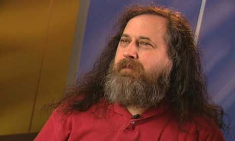

  

# 📂 The Philosophical Divide: Understanding GNU, Free Software, and Open Source

---

#### Read in Blog Format at avidflick.in

To read a simplified, browser-friendly version of this guide, check out the post on my blog
👉 [**Read: [The Philosophical Divide: Understanding GNU, Free Software, and Open Source] @ avidflick.in**](https://avidflick.in/the-philosophical-divide-understanding-gnu-free-software-and-open-source/)

---

#### 🔔 Connect & Stay Updated

Follow **avidflick_tech** across our social handles to get instant notifications, micro-learning clips, and real-time alerts whenever a new module, YouTube masterclass, or blog architectural update drops!

    
  

---

  
   
  <em>Richard Stallman</em>
   
  (Image Credits: Respective Owners)

The terms **“Free Software”** and **“Open Source”** are used so interchangeably today that their profound and foundational differences are often lost. If you use Linux, an Android phone, or virtually any internet service, you are using the outcome of this philosophical split. Understanding the debate is crucial, as it fundamentally dictates who controls the technology you rely on **you, the user, or the corporation that wrote the code.**

At its core, this debate is about **user control**. Free Software, championed by the Free Software Foundation (FSF), is an ethical imperative centered on user liberty. Open Source, promoted by the Open-Source Initiative (OSI), is a development model focused on practical benefits like collaboration and stability. While the code is often the same, their goals could not be more distinct. Knowing which model you support impacts the future of digital freedom.

### How did the GNU Project start?

The "Big Bang" moment for the entire Open Source movement. It happened in the late 1970s/early 1980s at MIT’s Artificial Intelligence Lab.

To understand why Stallman felt his "freedom" was violated, you have to look at how hackers (the good kind!) worked back then.

**The Story: The Xerox 9700**

Xerox had donated a laser printer to MIT. It was fast, but it jammed frequently. When it jammed, everyone’s print jobs would get stuck, and nobody would know until they walked all the way to the printer room.

* **The Old Way:** On the _previous_ printer, Stallman had modified the software so that whenever the printer jammed, the computer would send a message to every user: _"The printer is jammed, please fix it."_ This was early DevOps automation!

* **The Conflict:** When the new Xerox printer arrived, it also jammed. Stallman went to fix the software, but for the first time in his career, the software was **Proprietary**. The code was locked.

* **The Rejection:** He asked a fellow scientist at another university (who had the code) for a copy. The scientist refused because he had signed a **Non-Disclosure Agreement (NDA)** with Xerox.

**Why was this a "Violation of Freedom"?**

For Stallman, this wasn't just a technical inconvenience; it was a moral crisis. He saw it as a violation of three core human values:

**1\. The Loss of Control (Autonomy)**

Stallman believed that if you own a machine, you should be the master of that machine. By locking the source code, Xerox became the "master" of MIT’s printer. Stallman felt like a prisoner who wasn't allowed to fix his own cell door.

**2\. The Death of Community (Solidarity)**

This is what upset him the most. In the hacker culture of the 70s, sharing code was like sharing a recipe. If your neighbor's cake didn't rise, you gave them your recipe.When the other scientist refused to share the code because of an NDA, Stallman saw it as a **betrayal**. The company had forced a friend to be "unkind" to another friend.

**3\. Forced Helplessness**

He realized that if this "Proprietary" model became the standard, users would forever be at the mercy of big corporations. If the company went out of business or refused to fix a bug, the user was stuck with a "brick."

### What is the GNU Philosophy and the Four Essential Freedoms?

In 1983 with **Richard Stallman** at MIT, launched the **GNU Project** (a recursive acronym for “GNU is Not Unix”). His goal was to create a complete, free operating system that respected user rights, which he viewed as an ethical requirement.

The **Free Software Definition** outlines four **Essential Freedoms** that a program must grant users to be considered “free software”:

* **Freedom 0: Run.** The freedom to run the program as you wish, for any purpose.

* **Freedom 1: Study & Change.** The freedom to study how the program works and change it. **Access to the source code is a precondition.**

* **Freedom 2: Redistribute.** The freedom to redistribute copies so you can help your neighbor.

* **Freedom 3: Distribute Modified Versions.** The freedom to distribute copies of your modified versions. **Access to the source code is a precondition.**

This “free” refers to **“liberty” (as in free speech)**, not **“price” (as in free beer)**. You can charge money for Free Software, but since the source code is also available, the market generally drives the price down to zero. The philosophical weight lies in the guarantee of those rights.

In English, the word **"Free"** is confusing because it has two completely different meanings.

**1\. Free as in "Free Beer" (Price)**

When someone says, "There is free beer at the party," they are talking about **money**.

* **The Rule:** You don't have to pay for it.

* **The Limit:** You can drink the beer, but you don't own the recipe. You can't ask the brewer exactly what ingredients are inside, and you certainly aren't allowed to change the recipe and start selling your own version of that beer.

* **In Tech:** This is like "Freeware" (e.g., Adobe Reader or Google Chrome). You don't pay to download it, but the code is a secret. You are just a user.

**2\. Free as in "Free Speech" (Liberty)**

When we talk about "Free Speech," we aren't talking about money; we are talking about your **rights** and **freedom**.

* **The Rule:** You have the right to say what you want, to share your ideas, and to change your mind.

* **The Limit:** There is no limit! It’s about your power as a human to control your own expression.

* **In Tech:** This is **Free Software (GNU)**. Even if you paid $100 for the software, it is still "Free" because you own the "Source Code." You can open it, see how it works, change it, and share those changes with the world.

### The Mechanism of Freedom: Copyleft vs. Permissive Licenses

How does Free Software enforce these rights? Through **Copyleft**.

The most famous example is the **GNU General Public License (GPL)**. The GPL is a contractual mechanism that uses copyright law against itself. If you receive code under the GPL, you are free to modify and redistribute it, but the resulting derivative work _must also_ be licensed under the GPL. This ensures that the essential freedoms propagate to every subsequent user. It’s a “share and share alike” principle designed to prevent proprietary locking of the code.

### The Birth of Open Source: Pragmatism over Philosophy

In 1998, as free software began achieving significant technical success, a group of developers felt that the term “Free Software” was confusing and intimidating to businesses, who often mistook it as meaning “non-commercial.”

They founded the **Open-Source Initiative (OSI)** and coined the term **“Open-Source Software.”**

The OSI’s focus shifted from ethical freedom to **practical benefits**:

* **Reliability:** More eyes on the code means faster bug fixes.

* **Innovation:** Anyone can contribute, speeding up development.

* **Cost:** No vendor lock-in and no licensing fees.

While the OSI’s definition ensures source code is available and allows modification, its licenses are often **Permissive** (like the MIT or Apache licenses). These licenses allow proprietary projects to use the open-source code without being forced to release their own modifications.

This is the key schism:

* **FSF:** Prioritizes **perpetual freedom** for all users (e.g., Linux kernel, GCC).

* **OSI:** Prioritizes **flexibility and adoption** for developers and businesses (e.g., React, many cloud tools).

### The GNU/Linux Legacy and Modern Challenges

The success of Free and Open-Source Software (FOSS) is undeniable. The combination of **GNU tools** (like the C Compiler, Bash shell, and Core Utilities) with the **Linux kernel** (created by Linus Torvalds and licensed under the GPL) forms the **GNU/Linux** operating system, which runs the world’s most critical infrastructure.

Today, however, the digital landscape faces a new challenge to these freedoms: **Software as a Service (SaaS)**.

SaaS operates remotely, meaning you use the software (e.g., Google Docs, Salesforce) through your web browser, but the underlying code is executed on the company’s private server. Since you never receive a copy of the executable or the source code, none of the four freedoms (to study, modify, or share) apply. This trend effectively bypasses the protections of both Free Software and Open-Source licenses.

### Why the Philosophy Still Matters?

Choosing between using Free Software (GPL-licensed) or merely Open Source (permissive-licensed) is a choice between protecting the **future freedom** of all users or facilitating **short-term business adoption**.

As you interact with technology, remember that the core of the **GNU philosophy** is about establishing a society where users—not code writers—control the technology. Understanding this distinction is the first step toward advocating for a more transparent and user-controlled digital future.

**What software powers your life? Demand the source code, demand the freedom. Use FOSS.**

---

### 🔙 Navigation & Roadmap

* **Main Index:** [Return to Technical Modules List](../../README.md#-technical-modules)
* **Next:** [History of Linux Operating System](../001-history-of-linux-operating-system/README.md)

---
_Created by **Venkata Jagan Chennu** — DevOps Engineer | Simplifying Tech._
