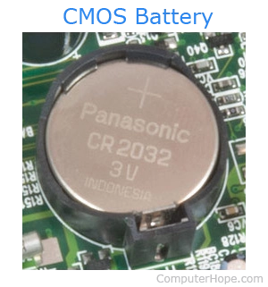
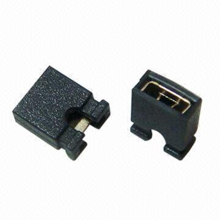
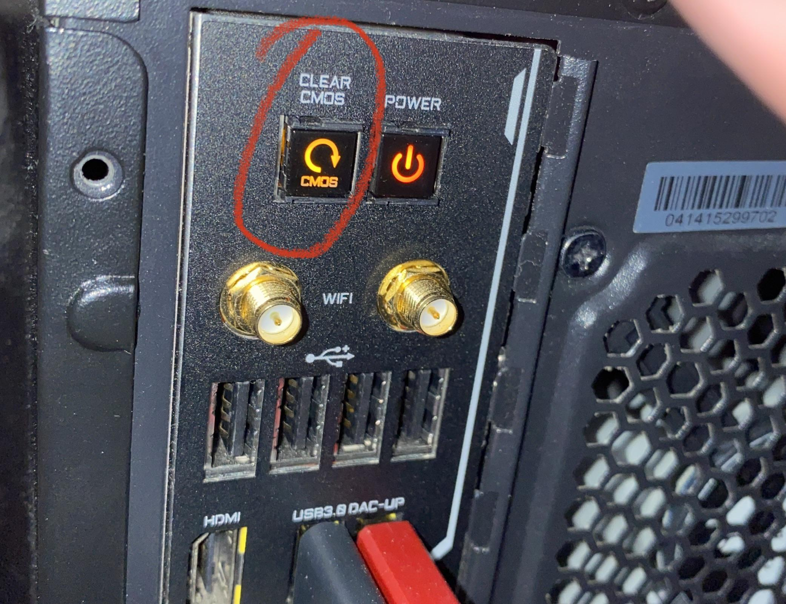
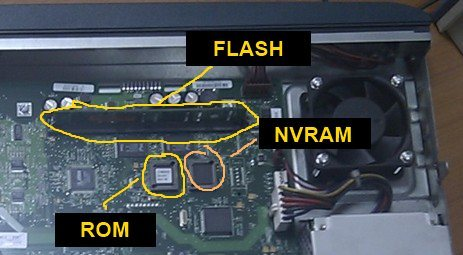

# CMOS

  
   
  <em>CR2032 Lithium Battery used to power CMOS memory</em>
   
  (Image Credits: Respective Owners)

In the context of firmware, **CMOS** (Complementary Metal-Oxide-Semiconductor) is often misunderstood. It isn't the firmware itself, but rather the **"Notebook"** where the firmware keeps its notes. To understand CMOS, you have to look at the relationship between the chip, the settings, and the battery.

### 1. The Relationship: BIOS/UEFI vs. CMOS

Think of it this way:

* **BIOS/UEFI (The Firmware):** This is the **Instruction Manual**. It is stored on a **Flash ROM** chip. It is permanent and doesn't disappear when the power goes out.

* **CMOS (The Memory):** This is a tiny amount of **RAM** (usually just 128 to 512 bytes). It stores the **Custom Settings** you chose in the manual—like your boot order, your overclocking settings, and the system clock.

### 2. Why does CMOS need a battery?

Because CMOS is a type of RAM (Random Access Memory), it is **volatile**. This means as soon as the electricity stops, it forgets everything.

To prevent your computer from forgetting the time and your boot settings every time you unplug it, a small coin-shaped battery (usually a **CR2032**) provides a tiny "trickle" of power to that CMOS chip. This keeps the memory alive and the clock ticking.

### 3\. What is stored in CMOS?

When you enter the "BIOS Setup" screen (by mashing **F2** or **Del**), you are editing the data stored in the CMOS. This includes:

* **System Time and Date:** The hardware clock (Real-Time Clock or RTC).

* **Boot Priority:** Should the PC check the USB, Network (PXE), or Hard Drive first?

* **Hardware Settings:** CPU voltages, memory timings, and enabled/disabled ports (like USB or onboard audio).

* **Passwords:** The BIOS supervisor or user passwords.

### 4. The "CMOS Clear" (The Reset)

Clearing the CMOS is a common troubleshooting step for DevOps and SysAdmins. If you set a BIOS password and forget it, or if a setting makes the computer refuse to boot, you can "Clear CMOS" by:

1. **Removing the coin battery** for a few seconds.

2. **Moving a "Jumper"** (a small plastic connector) on the motherboard.

   

     
      
     <em>Motherboard Jumper used for hardware-level CMOS resets</em>
      
     (Image Credits: Respective Owners)
   

3. **Pressing a "Clear CMOS" button** (found on high-end or server-grade motherboards).

  

     
      
     <em>Dedicated 'Clear CMOS' button on the Rear I/O panel</em>
      
     (Image Credits: Respective Owners)
   

> **Result:** The CMOS chip loses power, "forgets" the bad settings/password, and reverts to the **factory defaults** stored in the permanent BIOS Flash ROM.

## Modern Evolution: NVRAM

On modern **UEFI** systems, the term "CMOS" is becoming a legacy term. Most modern motherboards now store these settings in **NVRAM** (Non-Volatile RAM).

* **NVRAM** is like a tiny SD card; it doesn't need a battery to remember your settings.

* **The Battery** is still there, however, because it is required to keep the **System Clock** running while the main power is off.

  

     
      
     <em>NVRAM chip: The persistent storage for modern UEFI configurations</em>
      
     (Image Credits: Respective Owners)
   

## The DevOps Perspective

In a production data center, if a server's CMOS battery dies, it creates a high-priority incident:

* **The Symptom:** The server time resets to **January 1st, 1970** (the Unix Epoch).

* **The Disaster:** This causes **SSL/TLS certificate validation to fail** immediately. Because the server thinks it is living in 1970, it views a 2026 certificate as "not yet valid." Your server will be unable to:

  * Connect to the internet safely.

  * Update or download packages.

  * Join or communicate within a **Kubernetes** cluster.

---

### 🔙 Navigation & Roadmap

* **Continue Reading:** [Back to Boot & Init Main Article](../README.md)
* **Main Index:** [Return to Technical Modules List](../../README.md#-technical-modules)

---
*Created by **Venkata Jagan Chennu** — DevOps Engineer | Simplifying Tech.*